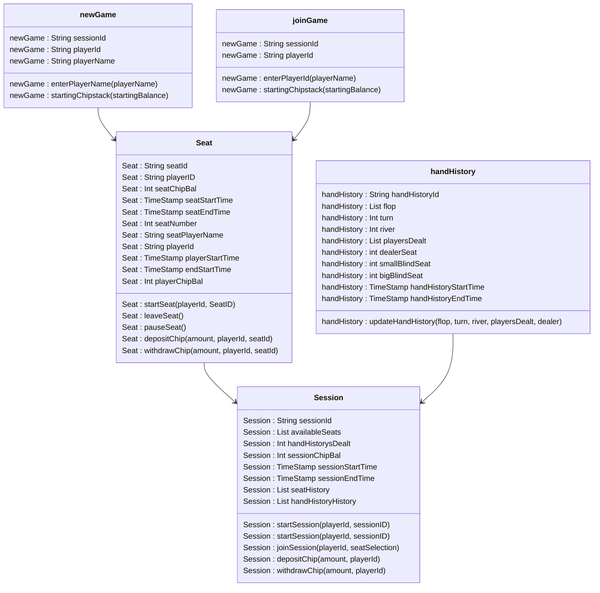

# uw-misfit-poker
Poker App

```mermaid
classDiagram
    newGame --> Seat
    joinGame --> Seat
    Seat --> Session
    handHistory --> Session

    class newGame{
    newGame : String sessionId
    newGame : String playerId
    newGame : String playerName
    newGame : enterPlayerName(playerName)
    newGame : startingChipstack(startingBalance)
    }

    class joinGame{
    newGame : String sessionId
    newGame : String playerId
    newGame : enterPlayerId(playerName)
    newGame : startingChipstack(startingBalance)
    
    }

    class Session{
    Session : String sessionId
    Session : List availableSeats
    Session : Int handHistorysDealt
    Session : Int sessionChipBal
    Session : TimeStamp sessionStartTime
    Session : TimeStamp sessionEndTime
    Session : List seatHistory
    Session : List handHistoryHistory

    Session : startSession(playerId, sessionID)
    Session : startSession(playerId, sessionID)
    Session : joinSession(playerId, seatSelection)
    Session : depositChip(amount, playerId)
    Session : withdrawChip(amount, playerId)
    }

    class Seat{
    Seat : String seatId
    Seat : String  playerID
    Seat : Int seatChipBal
    Seat : TimeStamp seatStartTime
    Seat : TimeStamp seatEndTime
    Seat : Int seatNumber
    Seat : String seatPlayerName
    Seat : String playerId
    Seat : TimeStamp playerStartTime
    Seat : TimeStamp endStartTime
    Seat : Int playerChipBal

    Seat : startSeat(playerId, SeatID)
    Seat : leaveSeat()
    Seat : pauseSeat()
    Seat : depositChip(amount, playerId, seatId)
    Seat : withdrawChip(amount, playerId, seatId)
    }

    class handHistory{
    handHistory : String handHistoryId
    handHistory : List flop
    handHistory : Int turn
    handHistory : Int river
    handHistory : List playersDealt
    handHistory : int dealerSeat
    handHistory : int smallBlindSeat
    handHistory : int bigBlindSeat
    handHistory : TimeStamp handHistoryStartTime
    handHistory : TimeStamp handHistoryEndTime

    handHistory : updateHandHistory( flop, turn, river, playersDealt, dealer)

    }


```